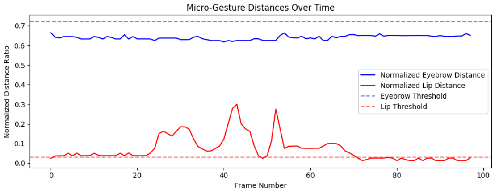

# Micro-Gesture Detection & Emotion Reasoning Pipeline

An end-to-end affective computing prototype designed to detect sub-second, concealed facial micro-gestures and use Large Language Models (LLMs) to contextually infer the subject's psychological state.

## 📌 Project Objective

Standard emotion recognition models rely heavily on macro-expressions (e.g., broad smiles, obvious frowns). This project explores a more nuanced approach by targeting **micro-gestures**—involuntary facial movements that last for fractions of a second and often reveal suppressed emotions. By combining scale-invariant spatial tracking with temporal summarization, this pipeline feeds clean, structured behavioral data into an LLM for clinical-style psychological evaluation.

## 📁 Dataset

This prototype was developed and tested using the **DepVidMood Facial Expression Video Dataset**.

* **Source:** [Kaggle - DepVidMood Dataset](https://www.kaggle.com/datasets/ziya07/depvidmood-facial-expression-video-dataset)
* **Relevance:** This dataset contains video recordings of facial expressions specifically curated for mood and depression analysis. Utilizing this data ensures the pipeline is tested against realistic, medically relevant affective states rather than exaggerated, acted emotions, making it highly suitable for micro-gesture extraction.

## ✨ Key Features

* **Scale-Invariant Tracking:** Utilizes MediaPipe's Face Mesh to extract landmarks. Distances are normalized using the subject's Interpupillary Distance (IPD) (via inner eye corners), ensuring the algorithm remains robust regardless of the subject's distance to the camera.
* **Temporal Summarization:** Employs a state-machine architecture to group frame-by-frame noise into distinct temporal events (e.g., "Lip compression for 0.90 seconds").
* **Generative AI Reasoning:** Integrates `TinyLlama-1.1B-Chat-v1.0` via HuggingFace Transformers to provide a brief, contextual psychological assessment based on the aggregated micro-gesture data.
* **Data Visualization:** Automatically plots normalized facial action distances against baseline thresholds over time using Matplotlib.

## 🛠️ Pipeline Architecture

| Stage | Technology | Description |
| --- | --- | --- |
| **1. Extraction** | OpenCV | Extracts raw video frames sequentially for analysis. |
| **2. Spatial Mapping** | MediaPipe | Maps 468 facial landmarks to isolate specific Action Units (AUs). |
| **3. Normalization** | NumPy | Calculates relative distances (e.g., vertical lip distance) divided by the IPD. |
| **4. Aggregation** | Python (Custom Logic) | Filters out micro-movements under 0.1 seconds and summarizes continuous events. |
| **5. Inference** | HuggingFace (TinyLlama) | Generates a clinical explanation of the detected temporal sequence. |

## 🚀 Installation & Usage

This project is built to run in a Jupyter Notebook / Google Colab environment.

**1. Clone the repository:**

```bash
git clone https://github.com/Negin-Hadad/micro-gesture-detection.git
cd micro-gesture-detection

```

**2. Install dependencies:**

```bash
pip install torch numpy transformers opencv-python matplotlib
pip install mediapipe==0.10.13

```

**3. Run the notebook:**

* Open `micro_gesture_detection.ipynb`.
* Authenticate your HuggingFace account when prompted (required for the LLM pipeline).
* Download sample videos from the DepVidMood dataset and update the `video_path` variable in the final cell to point to your local file.
* Execute the cells to view the temporal graph and the LLM's psychological evaluation.

## 📊 Example Output

* **Detected Gesture Summary:** `lip compression for 0.90 seconds`
* **LLM Assessment:** *"Based on the temporal micro-gesture data, the subject's emotional state is negative. Lip compression for 0.90 seconds indicates a significant decrease in positive emotions, such as joy and happiness, compared to the previous 0.90 seconds. This suggests a negative mood state and a lack of positive emotion towards the subject. The decrease in positive emotions could be due to various factors, such as stress or negative social interactions."*



```text
Detected gesture summary: lip compression for 0.90 seconds

LLM Explanation:
 Clinical Assessment: The subject's emotional state is low as shown by their reduced lip compression during the micro-gesture. This suggests a state of anxiety and restlessness, possibly due to stress or anxiety related factors. The subject's facial expression remains neutral and unemotional, indicating a lack of emotional expression. The subject's eyes do not show any significant change in their position or expression during the micro-gesture, suggesting a calm and collected state of mind. Overall, the subject's emotional state is considered low.
```
